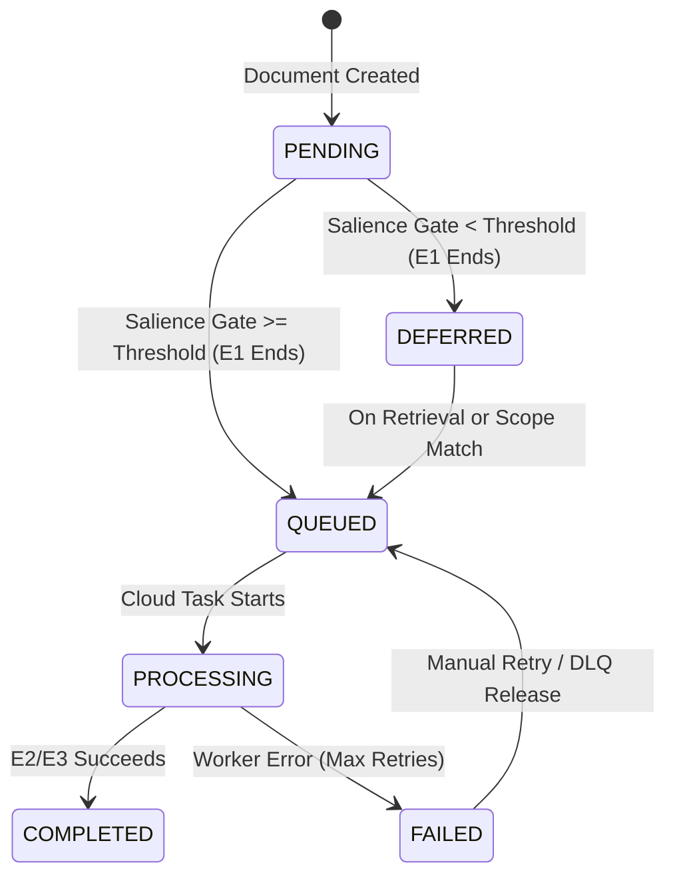

# Architectural Analysis: Lazy, Deferred, and On-Demand Extraction at Scale

## Key Findings

1. **Hybrid Eager-Chunk/Lazy-Relation Topology (D8/D14)**: We recommend an architecture where document text conversion (E0) and chunk embedding (E1) are always performed eagerly. This guarantees that all documents are represented in the vector space (P1) for semantic retrieval. The heavy LLM extraction stages—Claimify (E2) and relation normalization (E3)—are deferred via a Postgres-tracked state machine.
2. **Asynchronous "Extract-on-Retrieval" (D9)**: Synchronous claim extraction during a search query is rejected. An LLM-based claim extraction, coreference resolution, and relation normalization cascade takes 5–15 seconds, which violates the "zero LLM calls on query path" constraint (D9). Instead, retrieval of a deferred chunk serves raw text immediately and triggers a high-priority, asynchronous Cloud Tasks worker to promote the document's state.
3. **Interest-Based Fan-Out for K2 Scopes (D16)**: K2 scopes declare interest using structured schemas (e.g., specific entity types, sources, or chunk-level keywords). When a scope is initialized or its interest profile changes, a fan-out query in Postgres identifies deferred documents matching the criteria and enqueues them for background promotion.
4. **Preservation of "Rebuildable from Postgres" (D7)**: Lazy extraction does not break the D7 rebuild invariant. However, the salience gate's *decision* is itself versioned state that must be stored in Postgres (e.g., `processing_tier = DEFERRED`). During a system rebuild, the pipeline respects this state rather than re-running the non-deterministic salience gate.
5. **Mitigation of the "Dark Matter" Recall Risk**: Deferred documents are invisible to aggregate synthesis (K1–K3) and graph traversals (P2). We mitigate this through:
   - A low-priority background drain that systematically processes deferred files using excess API quota.
   - A user-facing query-completeness metric (e.g., "78% of matching documents fully extracted").
   - A manual salience-override mechanism.

---

## 1. Patterns for Deferred Heavy Processing in Data Pipelines

Building a cost-effective, high-quality data pipeline for millions of documents requires separating cheap, deterministic preprocessing from expensive, non-deterministic LLM analysis. Claim extraction and relation normalization represent the primary cost centers and quality bottlenecks of the `ugm` system. We evaluate five data pipeline patterns for managing this workload:

### A. Eager Materialization (Current Design Baseline)
In this pattern, every document undergoes the full cascade: E0 (Files) $\rightarrow$ E1 (Chunks) $\rightarrow$ E2 (Claims) $\rightarrow$ E3 (Relations).
- **Pros**: Complete coverage; the graph (P2) and knowledge repo (Plane K) are always fully up to date.
- **Cons**: Excessive cost. Processing 1,000,000 documents (averaging 10 pages/3,000 words each) results in 3 billion tokens. At $2.50 per million tokens for extraction, this represents a base cost of $7,500 for a single pass. If prompts, models, or ontology schemas change, re-running the pipeline is financially prohibitive.

### B. Lazy Materialization (On-Read Computation)
Computation is delayed until the data is requested by a query.
- **Pros**: Zero waste. We only pay for extracting information that an agent or user actually searches for.
- **Cons**: High and variable query-time latency (P99 latency exceeding 15 seconds). It makes interactive graph traversals and search recipes unusable.

### C. On-Read Triggering with Caching
Chunks are stored eagerly. When a chunk is retrieved, the pipeline checks if its parent document's relations have been extracted. If not, it triggers extraction, caches the result in Postgres, and returns it.
- **Pros**: Reduces cold-start latency for subsequent queries; keeps initial ingestion costs low.
- **Cons**: The first query to hit a deferred document still incurs the full extraction latency penalty unless handled asynchronously.

### D. Work Queues with Priority (Cloud Tasks / Celery)
All extraction tasks are managed via a queue. Tasks are categorized by priority:
- *Priority 1 (Interactive)*: Triggered by user query retrieval.
- *Priority 2 (Scope Interest)*: Triggered by K2 scope configuration changes.
- *Priority 3 (Background Drain)*: Low-priority, rate-limited processing of deferred documents to gradually fill the graph.
- **Pros**: Prevents system overload, enforces rate limits, and allows cost budgeting.
- **Cons**: Adds queue state management and introduces eventual consistency between chunk search (P1) and graph search (P2).

### E. Tiered/Staged Processing
A cheap salience gate runs early (e.g., during E0 or E1) using a fast, local model or heuristic filters. It classifies documents into:
1. `FULL`: Immediate claim extraction.
2. `DEFERRED`: Embed chunks (E1) only; delay E2/E3.
3. `CHUNKS_ONLY`: Embed chunks; never extract claims (e.g., for reference sections or system logs).
- **Pros**: Saves up to 90% of LLM costs by filtering out low-value boilerplate and duplicate content before claim extraction.
- **Cons**: The salience gate itself must be highly precise; false negatives permanently hide facts from the graph.

### Architectural Fit for UGM
The optimal architecture for `ugm` is a **Tiered Processing Model (Pattern E) combined with Priority-based Asynchronous Work Queues (Pattern D)**. 

By running E0 and E1 eagerly, we ensure that every document is partitioned into chunks and indexed in LanceDB (P1). This preserves semantic and lexical searchability across the entire corpus. We then use a Postgres-managed state machine to gate the transition to E2/E3.

| Stage | Processing Timing | Source of Truth | Cost Profile |
| :--- | :--- | :--- | :--- |
| **E0 (Files)** | Eager (On Ingest) | GCS / Postgres | Negligible (CPU/I/O) |
| **E1 (Chunks)** | Eager (On Ingest) | LanceDB / Postgres | Low (Embedding API) |
| **E2 (Claims)** | Deferred / On-Demand | Postgres | High (Frontier/Small LLM) |
| **E3 (Relations)** | Deferred / On-Demand | Postgres | High (LLM + Entity Registry) |

---

## 2. "Extract on First Retrieval" (On-Demand Extraction)

When a user or agent executes a search recipe, the P1 index (LanceDB) returns a list of candidate chunks. Under a lazy extraction model, some of these chunks will belong to documents that have not yet undergone E2/E3 extraction.

```
[Search Query] ──► [LanceDB (P1)] ──► Retrieve Chunks ──► Check PG for DEFERRED status
                                                              │
   ┌──────────────────────────────────────────────────────────┴────────────────────────┐
   ▼ (Status: EXTRACTED)                                                               ▼ (Status: DEFERRED)
Return Chunks + Graph Relations                                             1. Return Chunks Immediately (No Delay)
                                                                            2. Write Idempotency Lock
                                                                            3. Enqueue High-Priority Cloud Task
                                                                            4. Background: E2/E3 -> P2 Update
```

### Latency and UX Implications
A synchronous write-on-read implementation is highly problematic. The claim extraction cascade (Claimify $\rightarrow$ Coreference Resolution $\rightarrow$ Entity Resolution $\rightarrow$ Relation Normalization $\rightarrow$ Supersession Cascade) requires multiple chained LLM calls. Even with prompt caching and small models, P99 latency ranges from 5 to 15 seconds. Blocking the retrieval path violates D9 ("zero LLM calls on the query path").

Therefore, **on-demand extraction must be asynchronous**:
- **Query Path**: The search API retrieves the eagerly-indexed chunk from LanceDB, serves the text to the user/agent immediately, and returns a metadata flag: `partially_extracted: true`.
- **Ingestion Path**: The API enqueues a high-priority job in Cloud Tasks to process the parent document. The next query targeting this semantic region will benefit from the fully materialized graph relations.

### Preventing Double-Work and Lock Contention
If a popular query returns 10 chunks from the same deferred document, or if multiple users execute concurrent queries, the system must not trigger parallel extraction pipelines for the same file. To prevent this, we utilize PostgreSQL advisory locks and an idempotency ledger.

When the retrieval API detects a chunk from a `DEFERRED` document, it executes:

```sql
-- Acquire an advisory lock scoped to the document ID to prevent concurrent task creation
SELECT pg_advisory_xact_lock(hasher_sid('doc_lock', document_id));

-- Verify status inside the transaction
SELECT processing_status 
FROM documents 
WHERE id = :document_id 
FOR UPDATE;

-- If status is 'DEFERRED', transition to 'QUEUED' and commit
UPDATE documents 
SET processing_status = 'QUEUED', 
    updated_at = NOW() 
WHERE id = :document_id 
AND processing_status = 'DEFERRED';
```

If the status update succeeds, the worker enqueues a Cloud Task with a deduplication key derived from the document's content hash and processing version: `task_dedup_key = sha256(doc_hash + processing_version)`. Cloud Tasks natively rejects duplicate tasks within a 1-hour window, providing a secondary layer of protection against redundant execution.

### Postgres State Tracking
To support this workflow, the `documents` table requires additional fields to track the deferred state and trace execution history:

```sql
CREATE TYPE processing_tier_enum AS ENUM ('FULL', 'DEFERRED', 'CHUNKS_ONLY');
CREATE TYPE processing_status_enum AS ENUM ('PENDING', 'DEFERRED', 'QUEUED', 'PROCESSING', 'COMPLETED', 'FAILED');

ALTER TABLE documents 
  ADD COLUMN processing_tier processing_tier_enum NOT NULL DEFAULT 'DEFERRED',
  ADD COLUMN processing_status processing_status_enum NOT NULL DEFAULT 'PENDING',
  ADD COLUMN salience_score REAL,
  ADD COLUMN last_retrieved_at TIMESTAMP WITH TIME ZONE,
  ADD COLUMN retrieval_frequency INT DEFAULT 0,
  ADD COLUMN extraction_error_log TEXT;
```

### Industry Analogues
This pattern is used in large-scale retrieval architectures:
- **Zep (Graphiti)**: Uses "episodes" (raw messages) as the direct retrieval target while running edge-fact extraction asynchronously in the background. If an edge has not been consolidated, Zep falls back to chunk-based context vector assembly.
- **On-Demand RAG**: Search engines like Perplexity use eager indexing of pages but defer deep coreference and relationship synthesis until a user query focuses LLM attention on a specific set of documents.

---

## 3. "Extract on Scope Interest" (Targeted Extraction)

A K2 scope represents a domain-specific view over the corpus (e.g., a "competitor-intelligence" scope or a "people-profiling" scope). In a large corpus, a scope's creator only cares about a subset of entities and relations. Rather than extracting everything, the scope declares its **Interest Profile** to selectively promote matching documents from `DEFERRED` to `EXTRACTED`.

### Modeling Interest
We model interest using structured rules stored in the Postgres registry:

```sql
CREATE TABLE scope_interests (
    scope_id VARCHAR(255) REFERENCES scopes(id) ON DELETE CASCADE,
    interest_type VARCHAR(50) NOT NULL, -- 'ENTITY_TYPE', 'PREDICATE', 'METADATA', 'KEYWORD'
    value VARCHAR(255) NOT NULL,        -- e.g., 'Person', 'works_at', 'source_type:slack', 'quantum'
    created_at TIMESTAMP WITH TIME ZONE DEFAULT NOW(),
    PRIMARY KEY (scope_id, interest_type, value)
);
```

### Fan-Out and Matching Mechanism
When a new document is ingested, or when a K2 scope registration updates, we check for matches to trigger promotion. Because we index chunks eagerly in LanceDB, we can perform this matching using database queries rather than running LLM classifiers over every document.

We use two primary matching mechanisms:

1. **Deterministic Metadata Rules**: Checked via Postgres queries during the initial E0/E1 pipeline.
2. **Semantic / Keyword Filters**: Evaluated using our P1 search index (LanceDB) or Postgres Full-Text Search (FTS).

```
[K2 Scope Interest Registered]
             │
             ▼
[Generate Match Query] ──► Execute against PG (Metadata) or LanceDB (Semantic)
                                       │
                                       ▼
                         Identify Deferred Document IDs
                                       │
                                       ▼
                       Bulk-Transition status to 'QUEUED'
                                       │
                                       ▼
                          Enqueue Cloud Tasks (Batch)
```

For example, if a scope declares interest in the keyword `"semiconductor"` and the entity type `"Organization"`, the system executes a match query:

```sql
-- Retrieve deferred documents where chunks contain FTS matches for the keyword
SELECT DISTINCT d.id 
FROM documents d
JOIN chunks c ON c.document_id = d.id
WHERE d.processing_status = 'DEFERRED'
  AND c.fts_vector @@ to_tsquery('english', 'semiconductor')
LIMIT 1000;
```

For semantic matching, the system queries LanceDB using the scope's interest embeddings, retrieves the matching document IDs, and updates their status in Postgres:

```sql
UPDATE documents 
SET processing_status = 'QUEUED' 
WHERE id IN (:matching_ids) 
  AND processing_status = 'DEFERRED';
```

A batch processor then enqueues these document IDs into Cloud Tasks. This ensures that the heavy extraction step is targeted directly at documents relevant to active K2 scopes.

---

## 4. Consistency, Idempotency, and the Trigger Chain

Implementing deferred execution introduces eventual consistency challenges to a system designed to be "rebuildable from Postgres" (D7) using a per-document trigger chain (D12).

### Preserving "Rebuildable from Postgres" (D7)
D7 requires that all derived projections—P1 (LanceDB) and P2 (LadybugDB)—can be rebuilt from Postgres. If extraction decisions are dynamic and non-deterministic (e.g., a salience gate LLM decides to defer a document based on a floating-point score), a system rebuild could produce a different set of relations, breaking semantic consistency.

To prevent this:
1. **Store Decisions as State**: The salience gate's decision (`processing_tier`) and the gate's output (`salience_score`) must be stored in the Postgres `documents` table as immutable records.
2. **Rebuild Behavior**: When rebuilding P1 and P2, the system reads the stored `processing_tier`. If a document is marked `DEFERRED`, the rebuild script loads its E1 chunks into LanceDB but does not attempt to extract claims. If it is marked `COMPLETED`, the script loads both the chunks and the extracted E3 relations. The rebuild process never re-evaluates the salience gate.

### Interaction with the Per-Document Trigger Chain (D12)
The standard per-document trigger chain is: `E0 (Convert) -> E1 (Chunk/Embed) -> E2 (Claims) -> E3 (Relations)`. Under the deferred architecture, the chain is split:

```
[Document Ingest] ──► E0 (Convert) ──► E1 (Chunk & Embed) ──► [Salience Gate]
                                                                     │
                                        ┌────────────────────────────┴─────────────┐
                                        ▼ (Score >= Threshold)                     ▼ (Score < Threshold)
                                  Queue E2/E3 Tasks                           Set status = 'DEFERRED'
                                                                              Stop Pipeline
```

When a deferred document is promoted, a new task starts at E2, utilizing the existing E1 chunks stored in Postgres. This prevents reprocessing of E0 and E1.

### Postgres State Machine and Task Promotion
We define the state transitions of a document below:



### Safeguards Against Lost Work and Task Failures
To ensure the pipeline is reliable and does not silently drop messages, we implement the following safeguards:

1. **Cloud Tasks Retry and Dead-Letter Queue (DLQ)**: Tasks are configured with `max_retries = 2`. If a worker fails due to rate limits or transient LLM errors, Cloud Tasks retries with exponential backoff. If it fails a third time, the task is routed to a DLQ, and the worker updates Postgres:
   ```sql
   UPDATE documents 
   SET processing_status = 'FAILED', 
       extraction_error_log = :error_message 
   WHERE id = :document_id;
   ```
2. **Stale Task Sweeper**: An hourly cron job searches for documents stuck in `QUEUED` or `PROCESSING` for too long (indicating a lost task or crashed worker) and resets them:
   ```sql
   UPDATE documents 
   SET processing_status = 'DEFERRED' 
   WHERE processing_status IN ('QUEUED', 'PROCESSING') 
     AND updated_at < NOW() - INTERVAL '15 minutes';
   ```

---

## 5. Recall and UX Risks: The "Dark Matter" Problem

The primary trade-off of deferred extraction is the **recall gap**. Deferred documents are invisible to the graph projection (P2) and knowledge synthesis (Plane K). This creates a "dark matter" problem: facts exist in the raw chunks but are missing from the graph and belief networks.

```
       EAGER DOMAIN (Visible)                      DEFERRED DOMAIN (Dark Matter)
┌─────────────────────────────────┐               ┌─────────────────────────────────┐
│ • Chunks Indexed in P1          │               │ • Chunks Indexed in P1          │
│ • Claims Extracted in E2        │               │ • NO Claims Extracted           │
│ • Relations in Postgres/Graph   │               │ • NO Relations in Graph (P2)    │
│ • Synthesized into K1/K2        │               │ • Invisible to Global Queries   │
└─────────────────────────────────┘               └─────────────────────────────────┘
```

### Operational Acceptability
This trade-off is acceptable if:
1. **Search entry is hybrid**: The retrieval layer first queries the P1 vector/FTS index (which has 100% coverage). If a query relies solely on graph traversals (P2) without a prior chunk-lookup step, it will miss deferred relationships.
2. **The domain is power-law distributed**: In large corpora, a small subset of documents (e.g., primary sources, core specifications) contains the majority of the high-value relations. Boilerplate and redundant news documents represent the long tail.

### Mitigations

#### A. Priority-Based Background Drain
To prevent deferred documents from remaining unextracted indefinitely, we run a low-priority background worker. This worker queries Postgres for deferred documents sorted by their retrieval frequency or a heuristic salience score:

```sql
SELECT id 
FROM documents 
WHERE processing_status = 'DEFERRED' 
ORDER BY salience_score DESC, retrieval_frequency DESC 
LIMIT 50;
```

This worker processes these documents using idle rate-limit capacity or off-peak hours. This process ensures the graph eventually converges toward completeness.

#### B. Salience-Override Scoring
We calculate a document's salience score using a mixture of deterministic and semantic signals:

$$\text{Salience} = w_1 \cdot \text{InformationDensity} + w_2 \cdot \log(\text{RetrievalCount} + 1) + w_3 \cdot \text{ScopeMatchWeight}$$

- **Information Density**: Calculated during E0 (e.g., ratio of unique nouns to total words, or page count).
- **Retrieval Count**: How often its chunks are returned by P1 queries.
- **Scope Match Weight**: Boosted if the document matches active K2 scope interests.

If a document's calculated salience exceeds a configured threshold, the system automatically enqueues it for promotion.

#### C. Completeness Diagnostics
When executing a search recipe, the retrieval API returns a metric showing how much of the context is fully extracted. This gives calling agents visibility into the completeness of the retrieved data:

```json
{
  "results": [...],
  "diagnostics": {
    "total_chunks_retrieved": 20,
    "fully_extracted_chunks": 16,
    "deferred_chunks": 4,
    "completeness_ratio": 0.80,
    "deferred_document_ids": ["doc_08f12a", "doc_99b3e1"]
  }
}
```

If an agent receives a `completeness_ratio` below `0.90` and requires high precision, it can wait for the background promotion tasks to complete and then re-run the query.

---

## 6. Recommendations for the UGM Design

We recommend integrating a **Deferred Extraction Architecture** into the `ugm` system with the following specifications:

### 1. Database Schema Additions
Implement the following table structure in Postgres to track processing states, gate decisions, and queue tracking:

```sql
-- Track the version and parameters of the salience gate
CREATE TABLE salience_gate_versions (
    version_id VARCHAR(50) PRIMARY KEY,
    model_name VARCHAR(100) NOT NULL,
    threshold REAL NOT NULL,
    configured_at TIMESTAMP WITH TIME ZONE DEFAULT NOW()
);

-- Extended Document State Tracking
CREATE TABLE document_extraction_states (
    document_id UUID PRIMARY KEY REFERENCES documents(id) ON DELETE CASCADE,
    processing_tier processing_tier_enum NOT NULL DEFAULT 'DEFERRED',
    processing_status processing_status_enum NOT NULL DEFAULT 'PENDING',
    salience_score REAL DEFAULT 0.0,
    salience_gate_version VARCHAR(50) REFERENCES salience_gate_versions(version_id),
    task_id VARCHAR(255),                  -- Cloud Tasks ID for tracing
    retrieval_count INT DEFAULT 0,
    last_retrieved_at TIMESTAMP WITH TIME ZONE,
    error_count INT DEFAULT 0,
    last_error_message TEXT,
    updated_at TIMESTAMP WITH TIME ZONE DEFAULT NOW()
);

CREATE INDEX idx_doc_extract_status ON document_extraction_states(processing_status, salience_score DESC);
CREATE INDEX idx_doc_last_retrieved ON document_extraction_states(last_retrieved_at) WHERE processing_status = 'DEFERRED';
```

### 2. The Ingestion Pipeline (Plane E & P1)
Modify the E0/E1 worker cascade to handle deferred states:

```
[Ingest Document] 
       │
       ▼
[E0 Worker] ──► Convert to Markdown, extract PageIndex metadata.
       │
       ▼
[E1 Worker] ──► Chunk text via semchunk, generate embeddings.
       │        Write chunk vectors to LanceDB (P1).
       │
       ▼
[Salience Gate] 
       │
       ├─► Heuristic Check: File size, source type, and structural properties.
       ├─► ML Check: Fast classifier (e.g., using a small model like Claude 3.5 Haiku) 
       │   on the PageIndex summary.
       │
       ▼
[State Decision]
       │
       ├─► Score >= 0.65 ──► Set status = 'QUEUED'. Enqueue E2/E3 Cloud Tasks.
       └─► Score < 0.65  ──► Set status = 'DEFERRED'. Stop pipeline.
```

### 3. Asynchronous Promotion on Retrieval
The retrieval engine must not execute synchronous LLM calls. We implement the promotion flow within the retrieval API:

```python
# Pseudo-code for retrieval and background promotion trigger
def retrieve_context(query_vector, k=20) -> RetrievalResponse:
    # 1. Query LanceDB (P1) for candidate chunks
    chunks = lancedb_client.search(query_vector).limit(k).to_list()
    
    deferred_doc_ids = []
    processed_chunks = []
    
    # 2. Check document states in Postgres
    doc_ids = list({c['document_id'] for c in chunks})
    doc_states = db.query_document_states(doc_ids)
    
    for chunk in chunks:
        doc_id = chunk['document_id']
        state = doc_states.get(doc_id)
        
        if state.processing_status == 'DEFERRED':
            deferred_doc_ids.append(doc_id)
            # Record access for frequency-based priority scoring
            db.increment_retrieval_metrics(doc_id)
        
        processed_chunks.append(chunk)
    
    # 3. Trigger asynchronous background extraction for deferred documents
    if deferred_doc_ids:
        trigger_async_extractions(deferred_doc_ids)
        
    return RetrievalResponse(
        chunks=processed_chunks,
        completeness_ratio=1.0 - (len(deferred_doc_ids) / len(chunks)),
        deferred_documents=deferred_doc_ids
    )

def trigger_async_extractions(doc_ids: list[str]):
    for doc_id in doc_ids:
        # Use Postgres transactional advisory locking to prevent duplicate tasks
        if db.try_acquire_extraction_lock(doc_id):
            cloud_tasks.enqueue(
                queue="high-priority-extraction",
                payload={"document_id": doc_id},
                deduplication_id=f"{doc_id}_v1"
            )
```

### 4. Rebuild Drills and System Integrity (D7)
During a full system rebuild (e.g., rebuilding LanceDB indexes or the LadybugDB graph):
- The rebuild script queries the `document_extraction_states` table.
- Documents with `processing_tier = DEFERRED` or `CHUNKS_ONLY` have only their E1 chunks loaded into the LanceDB (P1) index. No claim extraction is attempted.
- Documents with `processing_tier = FULL` have their existing E3 relations loaded into LadybugDB (P2) and their claim embeddings loaded into LanceDB.
- This ensures that a rebuild is deterministic, fast, and does not trigger new LLM extraction calls.

### 5. Failure and Lost-Work Safeguards
- **Heartbeat Pattern**: The E2/E3 processing worker updates the document status to `PROCESSING` and sets a `heartbeat_expires_at` timestamp to `NOW() + INTERVAL '5 minutes'`.
- **Reconciliation Worker**: A cron job runs every 10 minutes to clean up failed tasks:
  ```sql
  UPDATE document_extraction_states 
  SET processing_status = 'DEFERRED', 
      error_count = error_count + 1,
      last_error_message = 'Task timeout / Heartbeat expired'
  WHERE processing_status = 'PROCESSING' 
    AND heartbeat_expires_at < NOW();
  ```
- **Dead-Letter Queue (DLQ) Notification**: If a document reaches `error_count >= 3`, its status transitions to `FAILED` and an alert is routed to our monitoring stack.

---

### Trade-Off Matrix

| Metric | Eager Materialization | Lazy / Deferred Extraction |
| :--- | :--- | :--- |
| **Ingestion Cost** | High ($7.50+ per 1k docs) | Low (~$0.15 per 1k docs) |
| **Search Path Latency** | Low (~300ms, zero LLM calls) | Low (~300ms, async trigger) |
| **Graph Completeness** | 100% (Instant updates) | Eventual (Dependent on usage & background drain) |
| **Ontology Migration Cost** | High (Requires rebuilding all docs) | Low (Only rebuilds active/extracted docs) |
| **Pipeline Complexity** | Low (Linear per-doc trigger) | Medium (Requires state machine & lock managers) |
